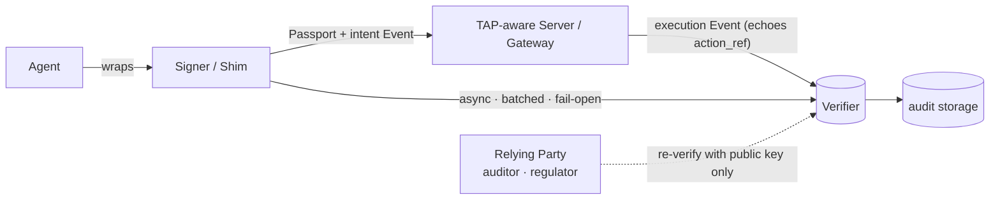
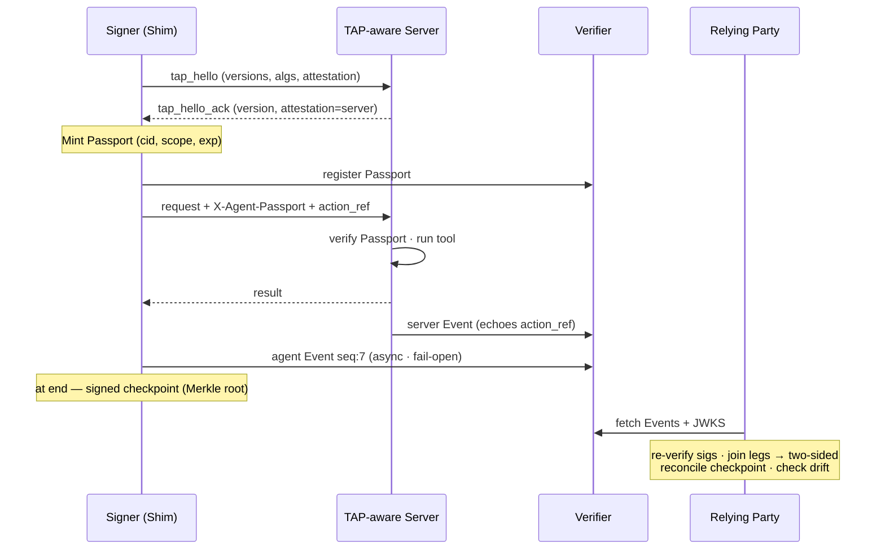

# The Traceable Agent Protocol (TAP)

### An Open Standard for Cryptographically Verifiable Agent Provenance

**Status:** Whitepaper · Companion to TAP Specification v0.1 · **Version:** 0.1.1 · **Date:** 2026-07-22
**License (intended):** Apache-2.0 (specification + reference code)
**Reference implementation:** `tap_ref.py` · **Conformance contract:** `test-vectors.json`

---

## Abstract: The OpenTelemetry for AI Agents

Autonomous AI agents execute complex, multi-step workflows across distributed systems — calling tools, querying databases, and delegating to one another — but they do so as black boxes. When an agent takes an unauthorized action, hallucinates a justification, or fails in a way that harms a user, there is no standardized, tamper-evident way to establish *which* agent acted, *under what authority*, *with what reasoning*, and *with what result*. Conventional application logs are mutable, unattributable to a decision, and unverifiable by a third party.

The Traceable Agent Protocol (TAP) is an open standard for **cryptographically verifiable agent provenance**. Like the Model Context Protocol (MCP) governs how agents *obtain* context and *call* tools, TAP governs the agent's *evidentiary record*: a signed credential (the **Passport**) asserting identity and authority, and signed, tamper-evident records (**Events**) of each action, carrying intent, reasoning, and result.

TAP is fundamentally a **payload and emission standard** — it defines the evidence, not the database. A frictionless developer SDK (the "Shim") wraps existing agent logic without rewriting it, generating signed records and pushing them asynchronously to any interchangeable Verifier — an enterprise ledger, a compliance bucket, or an existing observability platform. TAP signatures are produced at the source and verifiable by any third party against a published key, with no trust in the platform that stores them.

Three properties are central to v0.1: deterministic canonicalization (no fractional numbers in a signed body), a redaction-safe signed body (digests only, with human-readable plaintext in a crypto-shreddable annex), and signed checkpoints that make fail-open reporting mathematically safe.

---

## Zero-Refactoring Implementation (The Shim)

TAP is designed for adoption. Developers do not manage cryptographic keys or understand canonicalization schemes. The Shim automatically intercepts calls, mints credentials, signs intent, executes unmodified logic, and signs the result.

```python
import tap_sdk

# 1. Wrapping a Raw LLM Decision
@tap.trace(action_kind="decision", model="gpt-4o")
def evaluate_ticket(ticket_data):
    # Standard OpenAI call — TAP automatically hashes the prompt as intent
    # and the completion as the result.
    return client.chat.completions.create(...)

# 2. Wrapping an MCP Tool Call
@tap.trace(action_kind="tool_call", tool="db_query")
def query_database(query_string):
    # Standard MCP client execution — TAP intercepts args, signs pre-execution
    # intent, and records the final outcome.
    return mcp_client.call_tool("db_query", {"query": query_string})

# 3. Wrapping an Agent-to-Agent (A2A) Delegation
@tap.trace(action_kind="agent_delegate", target_agent="billing_agent")
def delegate_refund(user_id, amount):
    # Standard HTTP/RPC call — TAP handles parent_event_id chaining to link
    # execution context across distributed microservices.
    return httpx.post("http://billing-service/refund", json={...})
```

---

## Conventions and Terminology

The key words **MUST**, **MUST NOT**, **REQUIRED**, **SHOULD**, **SHOULD NOT**, **MAY**, and **OPTIONAL** are interpreted as in RFC 2119 / RFC 8174. This whitepaper is explanatory; where it states a normative rule it mirrors the specification, which governs on any conflict (§17).

Key terms:

- **record** — one agent task execution, bound by a single context id (`cid`). A record is the unit a Passport authorizes; it may comprise many Events and, across delegation, span multiple agents sharing the `cid`.
- **Event** — one signed, tamper-evident entry describing a single action within a record (§6).
- **chain** (or **transcript**) — the ordered set of Events belonging to a record, joined by `cid`, `seq`, and `parent_event_id`; for multi-agent work the chain is a tree (§8).
- **leg** — one side of a two-sided attestation: the agent-attested Event (intent) or the server-attested Event (execution) for the same action (§7).
- **annex** — the unsigned, redactable plaintext accompanying an Event, not part of its signing input (§6.1).
- **suite** — a named cryptographic algorithm set (e.g. `tap-ed25519`) negotiated for a session (§3.6).

---

## 1. Scope

TAP is a small family of coordinated artifacts. Defining the ecosystem up front is deliberate: a protocol is adopted through its artifacts, not its prose.

- **TAP Specification** — the normative wire contract: data formats, cryptography, canonicalization, transport bindings, and verification rules.
- **Reference Implementation** (`tap_ref.py`) — a minimal, dependency-light Signer/Verifier that is normative-by-example; it generates and self-checks the conformance vectors.
- **Conformance Vectors** (`test-vectors.json`) — a fixed seed and the exact Passport, Event, signing-input hash, and tamper case every implementation must reproduce byte-for-byte.
- **TAP SDKs (the Shim)** — Signer SDKs wrapping an existing agent without rewriting it (Python and Node/TypeScript ship today, each conformance-tested against `test-vectors.json`; Go planned), handling Passport minting, Event signing, carriage, and asynchronous fail-open reporting.
- **TAP Verifier** — the receiving service that validates signatures, checks integrity, labels assurance, and persists Events for audit (reference deployment: Sworn).
- **TAP-aware Gateway** — a proxy that performs server-side attestation on behalf of upstream tools not yet TAP-aware, so deployers reach two-sided assurance without waiting on the ecosystem (§4.3, §15).
- **TAP Inspector** — a developer tool (planned, analogous to the MCP Inspector) that mints test Passports, signs/verifies Events, and visualizes a record's chain locally.

> **Focus.** TAP standardizes the *provenance record* of agent behavior — identity, authority, action, reasoning, result — and its independent verification. It does **not** filter content, assess risk, or provide confidentiality. Like MCP, it governs one thing well and leaves adjacent concerns to layers above.

---

## 2. Concepts

### 2.1 Participants

TAP follows a signer–verifier architecture in which a **Signer** embedded with an agent mints credentials and signs records, and any party holding only the public key can verify them.

- **Agent** — the autonomous process taking actions.
- **Signer** — the component holding the private key; in practice the Shim SDK embedded with the agent.
- **TAP-aware Server** — a tool, resource, or receiving agent that validates an inbound Passport and MAY emit its own server-attested Event. Where the upstream is not TAP-aware, a **TAP-aware Gateway** stands in.
- **Verifier** — validates signatures, checks integrity, labels assurance, and persists Events for audit.
- **Relying Party** — any downstream consumer (auditor, compliance tool, regulator) that re-verifies records.

**Example:** a customer-support agent embeds the Shim. When it calls a `db_query` tool over MCP, the Shim attaches a Passport and signs an intent Event; a TAP-aware server (or Gateway) verifies the Passport and signs an execution Event echoing the same correlation id; both Events flow asynchronously to the Verifier; a compliance reviewer later re-verifies the entire chain against the published JWKS without trusting the Verifier's database.



### 2.2 Layers

- **Record layer** — defines the signed objects and their semantics: the Passport, the Event, canonicalization, action taxonomy, attestation, delegation, and verification rules. This is where TAP's guarantees live, independent of how records travel.
- **Transport layer** — defines how Passports ride on requests and how Events are reported: the HTTP header binding, the JSON-RPC `_meta` binding, and the asynchronous batched reporting endpoint.

### 2.3 Primitives

| Primitive | Asserts | Signing input |
|---|---|---|
| **Passport** | identity + authorized scope | `base64url(header).base64url(claims)` |
| **Event** | one action: intent, evidence, result | `JCS(body without sig)` (RFC 8785) |
| **Decision** | a choice among alternatives (specialized Event) | `JCS(body without sig)` |

---

## 3. Cryptographic Foundations

### 3.1 Signatures

TAP uses **EdDSA over Curve25519 (Ed25519)**, per RFC 8032 and RFC 8037 (`alg: "EdDSA"`). Implementations MUST use Ed25519, MUST NOT accept `alg: none`, and MUST NOT accept any other algorithm for a v0.1 session. Ed25519 signatures are 64 bytes — small enough for a per-action hot path — deterministic, and JOSE-native. New suites are introduced via version/suite negotiation (§3.6), never by widening an existing session.

### 3.2 Keys and Key Distribution

Public keys are published as a **JWKS** (RFC 7517 / RFC 8037, `kty: "OKP"`, `crv: "Ed25519"`). Every Passport and Event MUST carry the `kid` used to sign it; because `kid` is inside the signed body, it cannot be swapped without breaking the signature. Verifiers resolve `kid → public key` via `https://<issuer>/.well-known/jwks.json`. A JWKS entry MAY carry a `revoked_at` epoch-seconds field; verifiers MUST reject records signed by that `kid` at or after `revoked_at`.

### 3.3 Hashing, Digests, and Encoding

The hash function is **SHA-256**. A **digest string** is `"sha256:" + lowercase_hex(SHA256(bytes))`. The context id (`cid`) is a digest string over the canonical bytes of the parent task/prompt combined with a per-record nonce (≥ 128 bits entropy). Binary values use base64url without padding (RFC 7515 §2).

### 3.4 Canonicalization — the Interoperability Crux

Event signatures are computed over the **JCS canonicalization (RFC 8785)** of the Event body with `sig` removed. JCS fixes key ordering, whitespace, string escaping, and number formatting so two implementations produce identical bytes for the same logical object.

> **No fractional numbers in a signed body.** RFC 8785's number canonicalization is correct, but non-integer floating-point handling is the single most common source of cross-language divergence. TAP therefore forbids JSON numbers with a fractional part or exponent anywhere in a signed body. Conceptually fractional quantities (e.g. a decision `score`) MUST be encoded as **strings** (`"0.71"`) or integers in fixed minor units. The conformance vectors include a fractional-valued field to force this case.

### 3.5 Key Hierarchy and Environment Attestation

Embedding a long-lived private key in each of thousands of ephemeral agents — and placing a KMS/HSM call on every signature — is operationally unviable. TAP resolves this with a three-tier hierarchy:

1. **Issuing key (root of trust).** A long-lived KMS/HSM key that never signs Events directly. One issuing key serves a whole fleet.
2. **Signing key (ephemeral).** A short-lived Ed25519 keypair generated *locally* by the Shim — no HSM round-trip per signature. The issuing key signs a **key-attestation certificate** binding the ephemeral key to an agent id and short validity window.
3. **The signatures themselves**, produced locally at full speed with zero network latency.

A verifier resolves an Event's `kid` → attestation certificate → issuing key in JWKS, accepting the signature only if the ephemeral key was validly attested, in-window, and bound to the same `aid`. The HSM signs one short certificate per record, not one per action. An OPTIONAL `env` block in the certificate lets a deployment additionally attest *where* signing happened — a TEE quote, a SPIFFE workload identity — raising assurance that the key was minted in a trusted environment rather than exfiltrated.

### 3.6 Cryptographic Agility and Post-Quantum Readiness

Ed25519 is the right choice today, but a standard meant to produce *evidence that must hold for years* must plan for its eventual deprecation. TAP future-proofs on four fronts:

**1. Algorithm-driven verification.** A verifier never hard-codes Ed25519. It resolves `kid` to a JWK that *declares* its suite (`alg`/`crv`) and dispatches the matching routine — verification is already polymorphic over the key's declared suite.

**2. Named crypto-suite registry.**

| Suite id | Algorithm | Status |
|---|---|---|
| `tap-ed25519` | Ed25519 (RFC 8032) | v0.1 — REQUIRED |
| `tap-ml-dsa-65` | ML-DSA (FIPS 204, lattice) | RESERVED — post-quantum |
| `tap-slh-dsa-128s` | SLH-DSA (FIPS 205, hash-based) | RESERVED — conservative archival |

**3. Hybrid (composite) signatures for migration.** A Signer MAY attach *both* signatures in a `sigs` array — each `{ kid, alg, sig }`. A verifier accepts the record if any trusted suite verifies; forgery requires breaking *all* listed suites simultaneously. This lets the ecosystem migrate without a flag day.

**4. Hash agility.** Digest strings are self-describing (`"<alg>:<hex>"`), so `cid`, `args_digest`, and Merkle roots can migrate to stronger hash functions by registry addition.

**Long-term validation.** A Signer or Verifier SHOULD submit each signed **checkpoint** Merkle root (§6.3) to an RFC 3161 timestamp authority. The timestamp proves records existed, in exact form, at a point in time — so a record timestamped in year 1 is demonstrably not a later forgery, even if Ed25519 is later broken. Before a suite is deprecated, a Verifier re-attests archived records under a new suite (in the spirit of RFC 4998), chaining the old evidence forward.

> **Transport note.** PQ signatures are large (ML-DSA ≈ 2.4–4.6 KB vs Ed25519's 64 bytes). Where composite or PQ suites are in use, signatures MUST ride in the request body or `_meta` (§10), not in an HTTP header.

---

## 4. Lifecycle and Capability Negotiation

Like MCP, TAP is a **negotiated** protocol. A Signer and TAP-aware Server agree up front on the protocol version, algorithm suite, and attestation capabilities each supports. Negotiation is what makes adoption a gradient rather than a precondition.

### 4.1 The Handshake

```json
// Signer → Server (offered)
"tap_hello": {
  "versions": ["tap/0.1"],
  "algs": ["EdDSA"],
  "attestation": "requested",
  "kid": "key_2026_ref01"
}

// Server → Signer (selected)
"tap_hello_ack": {
  "version": "tap/0.1",
  "alg": "EdDSA",
  "attestation": "server",
  "checkpoints": "supported"
}
```

`attestation: "server"` tells the Signer the upstream will emit execution Events (two-sided assurance available); `attestation: "none"` means intent-only. If no mutually supported version exists, the parties fall back to unattested operation.

**Anti-downgrade.** Because the handshake is not signed, a network intermediary could strip it to force silent downgrade. To detect this, the Signer MUST bind the negotiated outcome — selected `version`, suite, and `attestation` level — into the first Event it signs, as a `nego` object under `evidence`. A verifier compares the claimed negotiation against what actually arrived; a missing server leg when `attestation:"server"` was recorded is flagged identically to a `conflicting` attestation.

### 4.2 Adoption as a Gradient

A Signer always functions: against a TAP-aware Server it gets `two-sided` assurance; against a Gateway it still gets `two-sided`; against an unaware endpoint it degrades to `intent-only` and says so. No counterparty upgrade is *required* for the agent to produce verifiable records — adoption raises assurance rather than gating function.

### 4.3 Passport Lifecycle — Mint, Renew, Seal

Passports have a short TTL (default ≤ 3600 s). For long-running records:

- **Mint** — at the start of a record, the Signer mints a Passport for the record's `cid` and `scope`.
- **Renew** — before `exp`, the Signer mints a successor sharing the same `cid`, carrying `prev_jti` referencing the predecessor. Scope MUST be a subset of the predecessor's (authority may narrow, never widen).
- **Seal** — at the end of a record, the Signer emits a final signed **checkpoint** (§6.3) closing the sequence; any further Event under that `cid` is anomalous.

### 4.4 The Gateway

Where an upstream tool is not TAP-aware, a **TAP-aware Gateway** sits in front: it terminates the handshake, verifies the inbound Passport, forwards the underlying request unchanged, observes the real result, and emits the server-attested Event. A deployer can blanket an entire fleet of legacy MCP servers with two-sided attestation by routing them through one Gateway.

---

## 5. The Passport — Identity and Authority

A Passport is a compact JWS/JWT (RFC 7519) asserting an agent instance's identity and authorized scope, minted once per record (or renewal segment) and attached to every action.

**JOSE header:** `{ "alg": "EdDSA", "typ": "tap-passport+jwt", "kid": "key_2026_ref01" }` — the explicit `typ` of `tap-passport+jwt` is REQUIRED (RFC 8725 token-confusion defense).

**Claims:**

| Claim | Type | Req. | Meaning |
|---|---|---|---|
| `iss` | string (URL) | MUST | Issuer; the JWKS origin used to resolve `kid` |
| `iat` | int (epoch s) | MUST | Issued-at |
| `exp` | int (epoch s) | MUST | Expiry; default TTL SHOULD be ≤ 3600 s |
| `jti` | string | MUST | Unique passport id (sortable, e.g. ULID) |
| `aid` | string | MUST | Agent instance id (unique per record) |
| `cid` | digest string | MUST | Context id binding this record's Events |
| `scope` | array\<string\> | MUST | Authorized capabilities, e.g. `read:database`, `call:tool` |
| `prev_jti` | string | MAY | Predecessor passport id on renewal (§4.3) |
| `meta` | object | MAY | Non-authoritative context: `framework`, `model`, `agent_name` |

Scope tokens are `"<verb>:<resource>"`. `meta` is never trusted for a security decision. **Validation:** verify `typ`, resolve and check `kid` revocation, verify signature, check `iat ≤ now < exp` with ≤ 60 s skew — only then treat `aid`/`cid`/`scope` as authoritative.

---

## 6. The Event — The Flight Recorder

An Event records one action via a detached Ed25519 signature over the JCS canonicalization of the Event body with `sig` removed. The signed body carries **digests, not raw data** (§6.1), reconciling tamper-evidence with data minimization.

### 6.1 Envelope

```jsonc
{
  "v": "tap/0.1",
  "event_id": "evt_01JABCDEF…",
  "passport_jti": "psp_01JABCDEF…",
  "aid": "agt_01JABCDEF…",
  "cid": "sha256:b6f6ed…",
  "seq": 7,
  "ts": "2026-01-01T00:03:11.482Z",

  "action": {
    "kind": "tool_call",
    "intent_digest": "sha256:…",
    "tool": "db_query",
    "scope_used": "read:database",
    "args_digest": "sha256:…"
  },

  "evidence": {
    "reasoning_digest": "sha256:…",
    "model_output_digest": "sha256:…"
  },

  "result": {
    "status": "success",
    "code": "OK",
    "latency_ms": 142,
    "error": null
  },

  "attestor": "agent",
  "action_ref": "act_01JABCDEF…",
  "parent_event_id": null,
  "policy_decision": null,
  "kid": "key_2026_ref01",
  "sig": "naUW4osbFd4ppCb7F2Qrre_Xx…"
}
```

> **Digests in the signed body; plaintext in a redactable annex.** The signed Event contains only SHA-256 digests of arguments, intent, and outputs — raw personal data is never placed in the signed payload. The corresponding plaintext travels in a separate, unsigned **annex** keyed by `event_id`:
>
> ```jsonc
> // annex — NOT signed; stored encrypted; crypto-shreddable
> { "event_id": "evt_01JABCDEF…",
>   "intent": "Call db_query to fetch users for the support ticket",
>   "args_preview": { "table": "users", "limit": 50 },
>   "reasoning": "The ticket references an account lookup; fetch the user row first." }
> ```
>
> While the annex exists, each plaintext field verifies against its signed digest. When an erasure obligation requires it, the annex is deleted (or crypto-shredded). The signed chain of digests remains perfectly intact, continuing to prove what was authorized and executed without retaining personal data.

### 6.2 Action Taxonomy

| `action.kind` | Edge | `action.tool` holds |
|---|---|---|
| `tool_call` | MCP / local tool | tool name |
| `agent_delegate` | A2A (outbound) | target agent id |
| `received_delegation` | A2A (inbound) | sending agent id; `parent_event_id` set |
| `agent_message` | A2A (non-task) | peer agent id |
| `denied` | any | the attempted target; `result.status = "denied"` |
| `decision` | reasoning | the decision key/label (§6.4) |
| `checkpoint` | integrity | the run/segment being sealed (§6.3) |

Implementations MAY define namespaced extension kinds prefixed `x-`; verifiers MUST preserve unknown kinds verbatim.

### 6.3 Sequence, Integrity, and Checkpoints

`seq` is a 1-based monotonic counter per `aid`. A verifier MUST flag gaps and duplicates; a duplicate `(aid, seq)` with differing content is a tamper/replay indicator.

A bare sequence gap is ambiguous: tampering (an Event was deleted) or benign loss (fail-open reporting). TAP resolves this with a signed **checkpoint** Event, emitted periodically and always at the end of a record:

```jsonc
"checkpoint": {
  "through_seq": 42,
  "event_id_root": "sha256:…",  // Merkle root over event_ids in (prev_checkpoint, 42]
  "count": 42
}
```

A verifier reconciles delivered Events against the latest checkpoint: an `event_id` in the Merkle commitment but never delivered is **provable deletion**, not benign loss. This turns "a gap is suspicious" into "a gap is provably malicious or provably benign," making fail-open reporting safe for integrity.

**Merkle construction (normative).** Leaves: `SHA-256(0x00 ‖ utf8(event_id))`; interior nodes: `SHA-256(0x01 ‖ left ‖ right)`. Odd-count levels promote the final node unchanged. A root mismatch is an integrity failure MUST be surfaced, not silently ignored.

### 6.4 Decision Events — The Counterfactual Ledger

A `decision` Event records the option taken *and* the options considered and rejected, with reasons. Because the entire option set is in the JCS signing input, an agent cannot later claim it weighed a different set. Scores are **strings** per §3.4:

```jsonc
"decision": {
  "question_digest": "sha256:…",
  "chosen": "refund",
  "options": [
    { "id": "refund",   "score": "0.71", "chosen": true,  "rationale_digest": "sha256:…" },
    { "id": "escalate", "score": "0.52", "chosen": false, "reason_digest": "sha256:…" },
    { "id": "deny",     "score": "0.10", "chosen": false, "reason_digest": "sha256:…" }
  ],
  "options_digest": "sha256:…"
}
```

Exactly one option MUST have `chosen: true`. To raise the bar from *commitment* to *consistency with cognition*, the option set SHOULD be reflected in `model_output_digest` so the recorded counterfactual is bound to the actual model output.

### 6.5 Signing and Verification

**Sign:** remove `sig` → `JCS(body)` (RFC 8785, no fractional numbers) → Ed25519-sign → set `sig`. `kid` is part of the signed body. **Verify:** remove `sig` → `JCS(body)` → resolve `kid` (check revocation) → Ed25519-verify. On failure the Event is invalid and MUST be marked as such — never silently dropped; an invalid signature is itself evidence.

---

## 7. Two-Sided Attestation

`attestor` distinguishes who signed an Event: `"agent"` attests **intent** ("I am calling `db_query`"); `"server"` attests **execution** ("`db_query` ran and returned OK"), signed by an independent key. A verifier correlates legs on `(aid, action_ref)` and assigns assurance:

| Assurance | Condition |
|---|---|
| `intent-only` | agent leg present; no server leg |
| `two-sided` | agent + server legs present and consistent |
| `conflicting` | legs disagree → integrity alert |

Two legs are *consistent* when they agree on `cid`, `action.tool`, and `action.kind`, and their results do not contradict. A compromised Signer can attest false intent but cannot forge the server's independent signature over the actual execution — `conflicting` is a high-signal alert and `two-sided` is the assurance to design toward. Implementations MUST label assurance honestly and MUST NOT imply server attestation that did not occur.

---

## 8. Delegation, Chains, and Replay

**Chains.** Multi-agent workflows form a tree. An orchestrator delegating over A2A emits an `agent_delegate` Event; the receiving agent operates under its own Passport sharing the same `cid`, and emits a `received_delegation` Event whose `parent_event_id` references the orchestrator's `agent_delegate`. A verifier reconstructs the chain by joining on `cid` and `parent_event_id`. A broken or unverified handoff MUST break the chain visibly, never be silently bridged.

**Replay defense** rests on three elements verifiers and TAP-aware Servers MUST enforce: Passport `exp` (short TTL) bounds validity; `jti` uniqueness rejects repeated passports; and `(aid, seq)` monotonicity rejects duplicates/regressions. A receiving A2A Server SHOULD keep a short-TTL cache of seen `(aid, seq)` and `jti`, with TTL ≥ max accepted Passport TTL plus 60 s skew allowance.

---

## 9. Policy Decisions and Drift

TAP standardizes the **record** of a policy decision, not the policy language. An enforcement point attaches:

```json
"policy_decision": { "decision": "deny", "rule_id": "no-prod-delete",
                     "policy_version": "sha256:…" }
```

`policy_version` is a digest over the canonical policy set in force, letting an auditor prove *which policy governed a historical action*. **Drift** is the minimal built-in policy: `action.scope_used` MUST be ⊆ Passport `scope`; a violation is `DENIED_SCOPE`. Because drift is checked against the signed Passport scope, it is cryptographically grounded, not a heuristic.

**Result-code registry** (implementations MAY add `x.<vendor>.<code>`):

| Code | Meaning |
|---|---|
| `OK` | action completed successfully |
| `DENIED_SCOPE` | `scope_used` ⊄ Passport `scope` — drift |
| `DENIED_POLICY` | denied by an explicit policy rule |
| `TOOL_ERROR` | the tool or target agent raised an error |
| `TIMEOUT` | action exceeded its deadline |
| `UPSTREAM_4XX` | upstream rejected the request |
| `UPSTREAM_5XX` | upstream failed to process the request |
| `VALIDATION_ERROR` | request or arguments were malformed |

---

## 10. The Transport Layer — Bindings

The same signed bytes verify identically across all transport bindings.

**HTTP** (remote MCP servers, A2A HTTP endpoints). The Passport rides in `X-Agent-Passport: <compact-jwt>` and correlation in `X-TAP-Action-Ref: <action_ref>`; the handshake rides in `X-TAP-Hello` / `X-TAP-Hello-Ack`. These sit alongside any `Authorization: Bearer` token — TAP adds provenance, it does not replace access control.

**JSON-RPC `_meta`** (stdio MCP, A2A Tasks/Messages). Where no HTTP headers exist, TAP metadata rides in request `_meta`:

```json
"_meta": { "tap": { "hello": {…}, "passport": "<compact-jwt>", "action_ref": "act_…" } }
```

**Event reporting.** Signed Events and annexes are delivered to a Verifier out-of-band, asynchronously, batched, at `POST /v1/events` accepting `{ "events": [ … ], "annexes": [ … ] }`; the Verifier returns per-`event_id` acks for idempotent buffering. Reporting is **fail-open**: a Signer MUST NOT block execution on reporting availability. Signed checkpoints (§6.3) make this safe for integrity — loss is bounded and reconcilable.

---

## 11. Privacy and Data Minimization

The immutable signed record contains **only digests** — never raw arguments, reasoning, intent text, or model output. Human-readable plaintext lives in the unsigned annex (§6.1), which can be stored encrypted and crypto-shredded: deleting the key destroys access to plaintext while the signed chain remains valid. A digest of deleted data is not personal data. TAP records provenance, not confidentiality; transport SHOULD use TLS.

---

## 12. Security Considerations

| Threat | Mitigation |
|---|---|
| Stored-record tampering | per-Event signature; any edit breaks verification (§6.5) |
| Record deletion / dropped reports | signed checkpoints + Merkle reconciliation (§6.3) |
| Algorithm substitution | one suite pinned per session; `none`/RS/HS rejected (§3.1) |
| Token confusion (Passport ↔ Event) | explicit `typ` + distinct signing schemes (§5, §6.5) |
| Replay | `exp` + `jti` + `(aid, seq)` + edge cache (§8) |
| Forced downgrade (handshake stripping) | negotiated outcome bound into the signed leg (§4.1) |
| Key compromise | short-lived attested ephemeral keys + `revoked_at` (§3.2, §3.5) |
| Quantum break of EdDSA | suite agility + composite signatures + timestamp anchoring (§3.6) |
| Canonicalization ambiguity | RFC 8785 + no fractional numbers (§3.4) |
| Compromised Signer signing false intent | independent server attestation (§7) |
| PII in the immutable record | digests-only body + crypto-shreddable annex (§6.1, §11) |

**Scope of guarantees.** TAP proves *what an agent did and who signed for it*. It does not prove the *truthfulness* of stated reasoning, nor stop a fully compromised Signer from signing fluent lies. The structural answer is independent server attestation (§7), model-output-bound counterfactuals (§6.4), and a record any skeptical third party can check without trusting anyone.

---

## 13. Worked Example

A single in-scope `tool_call` against a TAP-aware server, end to end.



**Step 1 — Negotiate.** Signer sends `tap_hello` offering `["tap/0.1"]`, `algs:["EdDSA"]`, `attestation:"requested"`. Server replies selecting `tap/0.1`, `attestation:"server"`. The session is two-sided-capable.

**Step 2 — Mint.** Signer mints a Passport: `cid = sha256(prompt ‖ nonce)`, `scope = ["read:database","call:tool"]`, `exp = iat + 3600`. Registers/reports the Passport to the Verifier so drift checks can run.

**Step 3 — Act (agent Event).** Calling `db_query`, the Signer emits `seq:7`, `kind:"tool_call"`, `scope_used:"read:database"`, `args_digest:sha256(…)`, `attestor:"agent"`, `action_ref:"act_…"`. Plaintext goes to the annex. Execution does not block on reporting.

**Step 4 — Attest (server Event).** The TAP-aware server verifies the Passport, runs the query, and emits its own Event: `attestor:"server"`, same `action_ref`, `result:{status:"success",code:"OK"}`.

**Step 5 — Report and seal.** Both legs flow to `POST /v1/events`. At the end of the record the Signer emits a `checkpoint` sealing `through_seq` with a Merkle `event_id_root`.

**Step 6 — Verify (Relying Party).** An auditor fetches the JWKS, re-verifies every signature, joins the two legs on `(aid, action_ref)` → `two-sided`, reconciles against the checkpoint (nothing missing), and confirms `scope_used ⊆ scope`. No trust in the Verifier's storage is required at any point.

---

## 14. Conformance

| Class | MUST implement |
|---|---|
| **Signer** | §3 crypto (incl. no fractional numbers); §5 Passport minting + renewal; §6 Event signing over JCS; §6.3 checkpoints; §10 carriage; fail-open reporting |
| **Verifier** | §3 verification + revocation; §5 Passport validation; §6.5 Event verification; §6.3 checkpoint reconciliation; §8 chain join + replay; §7 assurance labeling; §9 code preservation |
| **TAP-aware Server / Gateway** | §4.1 handshake; Passport verification; §7 server-attested Events echoing `action_ref`; §8 replay cache; OPTIONAL policy enforcement (§9) |

All classes MUST pass `test-vectors.json`: reproduce the reference Passport and Event signatures from the fixed seed (`9d61b1…7f60`; JWK `x = 11qYAYKxCrfVS_7TyWQHOg7hcvPapiMlrwIaaPcHURo`, `kid = key_2026_ref01`), reject the tampered variant, and reproduce the fractional-field and checkpoint-reconciliation cases. The reference seed MUST NOT be used in production.

v0.1 mandates `tap-ed25519` and **algorithm-driven verification** (a verifier MUST dispatch off the key's declared suite) so future suites require no verifier rewrite. A conforming verifier MUST reject any suite it does not recognize rather than fall back to a default.

---

## 15. Ecosystem and Adoption

TAP's adoption strategy mirrors MCP's: make the protocol trivial to join from any side, and ship the artifacts that make joining real.

- **SDKs (the Shim).** A decorator and MCP instrumentation, not a rewrite. Python and Node/TypeScript both ship today, each validated against the same conformance vectors so they cannot diverge; Go follows.
- **Reference Verifier.** An open, runnable Verifier (the Sworn reference deployment) exposing registration, JWKS, batched ingest, and record queries.
- **The Gateway.** A drop-in proxy bringing two-sided attestation to upstreams that have never heard of TAP — breaking the chicken-and-egg by letting a deployer reach high assurance on day one without any counterparty upgrade.
- **The Inspector.** A local developer tool to mint test Passports, sign/verify Events, and visualize a record's chain locally.
- **A single crypto source of truth.** Every artifact imports the reference implementation; because that file *is* the conformance contract, Signer and Verifier cannot drift apart.

Negotiation plus reference artifacts turn adoption from a precondition into a gradient: an agent produces verifiable records against anything, and every upgrade on either side simply raises assurance.

---

## 16. Compliance Context

> **Language discipline.** TAP *records and provides evidence for* regulatory obligations; it does not, by itself, make any deployer "compliant." Documentation MUST say TAP "supports" or "provides evidence for" an obligation — never that it "certifies" anything. The crosswalk below is engineering orientation, **not legal advice**; regulatory text is paraphrased and should be reviewed by qualified counsel before any external claim.

Regulators are moving from "do you have logs?" to "can you prove what the agent did?" Conventional logs fail on four counts auditors probe — mutable, not attributable to a decision, not under the accountable party's control, and unverifiable by a third party. TAP is built for the second question.

The EU AI Act (Regulation 2024/1689) requires high-risk systems to technically allow automatic event recording (Art. 12), keep logs traceable and retrievable (Arts. 12, 19, 26), and retain deployer logs ≥ 6 months (Art. 26(6)); high-risk obligations become binding 2 August 2026. NIST AI RMF's GOVERN/MEASURE/MANAGE functions and the NIST AI Agent Standards Initiative's call for agent auth/authz and audit trails map directly onto the Passport (authorization) and the provenance log (audit). The annex/crypto-shred design (§11) is the GDPR erasure story. The forthcoming prEN ISO/IEC 24970 on AI event logging is the standard to track; being its reference implementation is the strategic goal.

---

## 17. Roadmap and Open Questions

The v0.1 design closes the interoperability and privacy gaps that most often bite implementers: deterministic numbers (§3.4) remove float-canonicalization divergence; the digests-only signed body with redactable annex (§6.1, §11) reconciles tamper-evidence with erasure; and signed checkpoints (§6.3) disambiguate sequence gaps under fail-open reporting.

What remains is execution and ecosystem. Python and Node Shims already ship and both reproduce `test-vectors.json` byte-for-byte; a **Go Shim** is the next language to prove the conformance contract holds across runtimes. The reference Verifier already enforces revocation (`revoked_at`) and checkpoint Merkle reconciliation, but does **not yet** check the `nego` anti-downgrade binding (§4.1) against actual assurance achieved — that is a near-term correctness gap in the reference implementation, not a spec change. Beyond that: roll the **key hierarchy** (§3.5) to production KMS/HSM with environment attestation — today every Shim signs with a single flat key, with no ephemeral-key minting or attestation certificate yet implemented; stand up the **post-quantum path** (§3.6) — register `tap-ml-dsa-65`/`tap-slh-dsa-128s`, implement composite signatures, begin timestamp-anchoring checkpoint roots to an RFC 3161 authority (none of this has code yet); publish the **Gateway** and **Inspector** (neither exists in any form today — the Gateway in particular is the highest-leverage unshipped piece, since it is what lets a deployer reach two-sided assurance without waiting on upstream tool vendors); define the **policy-language Service Profile**; and align with **prEN ISO/IEC 24970**, **FIPS 204/205**, and the broader MCP/A2A security efforts.

The deepest open question remains inherent and acknowledged: TAP proves authorship and integrity, not honesty. It cannot establish that an agent's stated reasoning is its *real* reasoning, or that a compromised Signer is not signing fluent lies. The answer is structural — independent server attestation, model-output-bound counterfactuals, signed checkpoints, and a record any skeptical third party can check without trusting anyone.

---

## 18. References

RFC 2119 / 8174 (keywords) · RFC 8032 (Ed25519) · RFC 7515 / 7517 / 7518 / 7519 (JOSE / JWK / JWS / JWT) · RFC 8037 (EdDSA/OKP in JOSE) · RFC 8725 (JWT BCP) · RFC 8785 (JCS) · RFC 3339 (timestamps) · RFC 3161 (timestamp authority) · RFC 4998 (Evidence Record Syntax) · FIPS 204 (ML-DSA) · FIPS 205 (SLH-DSA) · NIST post-quantum cryptography · JSON-RPC 2.0. Model Context Protocol specification and architecture overview (structural model). Companion documents: *TAP Specification v0.1*, `tap_ref.py`, `test-vectors.json`, and the Sworn platform documentation.

---

*TAP is an open standard stewarded by Sworn, modeled structurally on the Model Context Protocol. Specification and reference code are intended for Apache-2.0 release. This whitepaper is a companion to the normative TAP Specification v0.1; where the two differ on any technical point, the specification governs.*
